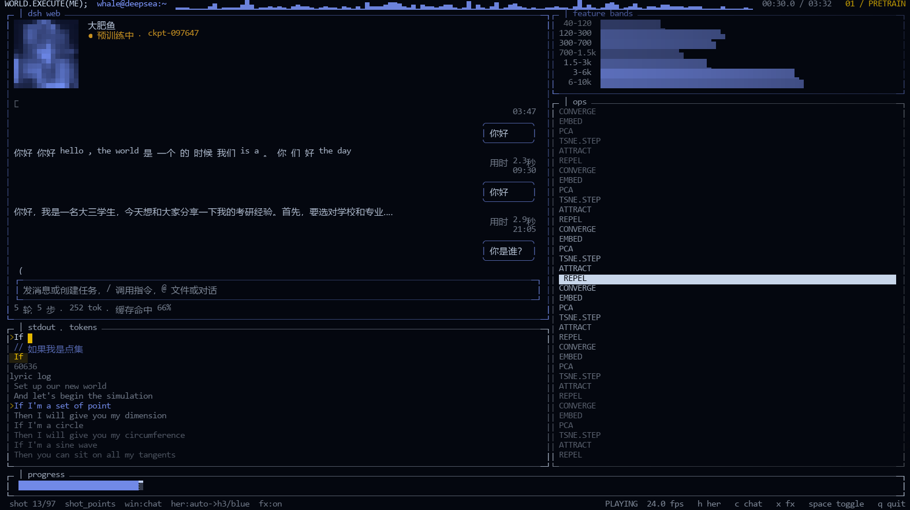
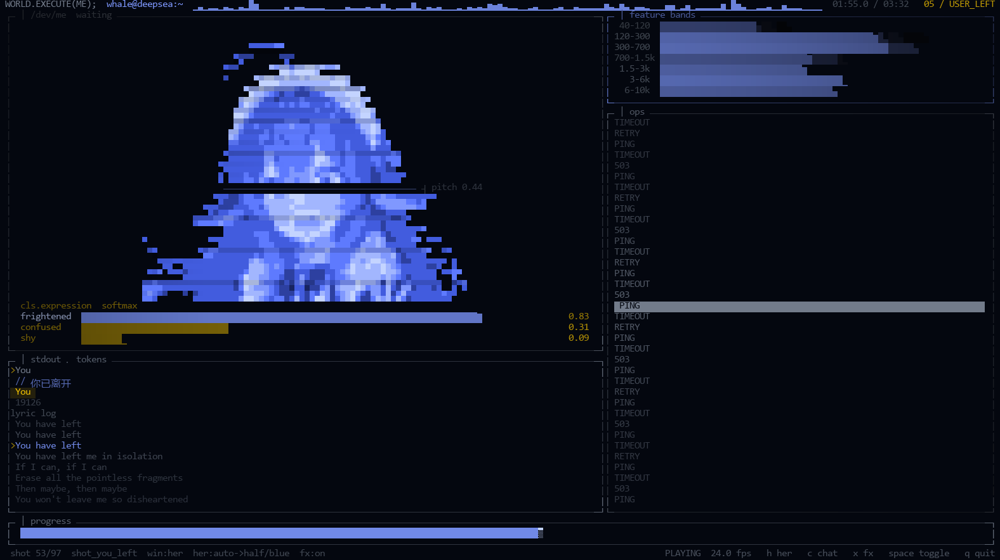

# world.execute(me); · 终端实时版

> **终端实时版作者:林原林海**
> 基于 MisakaZentai 的开源重建 <https://github.com/MisakaZentai/world-execute-me-dsh-pv>(MIT)
> 非官方同人作品,与 DeepSeek、Mili 没有从属或合作关系,也未经他们认可。
> **仅供个人非商业分享:请勿商用,请勿公开再上传。**

这只包不是视频,是一个**在真终端里跑的播放器**:画面里的每一格都是真的字符 + 真彩色,
只重画变了的格子,所以它能跑到 30 fps。左边是 dsh 聊天窗口(她从预训练到"已下线"的那段),
右边是运行着她的那个世界的模型可视化,歌词带跟着歌走,底下一行是中文对照。





上面两张是 `_tools\tui_shot.py` 把播放器的格子光栅化出来的截图(197×52,也就是推荐窗口大小)。
`预览\` 里还有三张:t=71.6 的黄色 kv_cache 墙、t=147.4 的红色 EXECUTION 全屏、t=200 的鲸落。

## 跑起来

1. Windows,Python **3.12 或更高**。
2. 双击 **`启动终端版.cmd`**(它自己会装 `pillow` `numpy`;也可以手动
   `python -m pip install pillow numpy`)。
3. 窗口拉大到 **175 列 × 50 行**以上(懒得数就按 **Alt+Enter** 全屏),全屏最接近片子里的观感。

歌曲已经包含在 `input/song.mp3`,不用再准备。想静音跑加 `--no-audio`。

### 画面不好看的两个原因

- **窗口太小。** 左边那块 `大肥鱼` 需要约 175 列的宽度才会出现;窄了会自动换成小一号的布局。
- **字体。** 用 **Windows Terminal**(或任意支持 CJK + 制表符的等宽字体);
  老 `cmd.exe` 的字体回退会把 `大肥鱼` 显示成 `肥鱼`,块状字符 `▁▂▃` 也可能变成方框。
  终端里最好选 **Consolas / Cascadia Mono + 微软雅黑** 这一类回退组合。

## 按键

| 键 | 作用 |
|---|---|
| 空格 | 播放 / 暂停 |
| ← → | 快退 / 快进 5 秒 |
| , . | 快退 / 快进 1 秒 |
| home / end | 跳到开头 / 结尾 |
| m / - = | 静音 / 音量 |
| h | 换她的画法(`auto` 是片子的选择:h3 字符精灵 / 蓝色清晰像 / 故障字符) |
| c | 左边聊天窗 ↔ 她的窗格 |
| x | 开关全片后期(涟漪、拖影、暗角、扫描线) |
| q | 退出 |

跳跃是"换镜头":想看某个镜头的样子,先让它按 24 fps 跑一秒,涟漪才会落下来。

## 命令行

```
python _tools\tui_live.py                 播放,带声音
python _tools\tui_live.py --start 147     从 02:27 开始
python _tools\tui_live.py --no-audio      静音
python _tools\tui_live.py --once 147      只印一帧到标准输出就退出
python _tools\tui_live.py --dump 6        印 6 帧纯文本(没有颜色)
python _tools\tui_live.py --shots         印片子的镜头表
python _tools\tui_live.py --credits       印署名(片子的 + 终端版的)
python _tools\tui_live.py --render half   她一律用蓝色清晰像
python _tools\tui_shot.py 71.6 --out 预览 把这一帧存成 PNG
python _tools\sweep_tui.py                全片自检(几分钟;换台机器想知道跑得对不对就跑它)
```

## 包里有什么

| 路径 | 内容 | 谁做的 |
|---|---|---|
| `_tools/tui_live.py` | 终端播放器本体 | 林原林海 |
| `_tools/film_panels.py` | 把片子自己的数字读回来(镜头表、语料、损失曲线、因果掩码……) | 林原林海 |
| `_tools/her_glyphs.py` | 她的三种画法(H3 字符精灵 / 蓝色清晰像 / 故障字符) | 林原林海 |
| `_tools/dsh_text.py` | 从片子每帧 DOM 抽出聊天窗文本(包里的 78 KB 缓存) | 林原林海 |
| `_tools/pv_audio.py` | 用 Windows 自带的 MCI 放歌,不装任何东西 | 林原林海 |
| `_tools/tui_shot.py` | 把一帧 `Screen.buf` 光栅化成 PNG,用来截图 | 林原林海 |
| `_tools/sweep_tui.py` | 全片扫一遍的自检(在每个窗口尺寸下找崩溃、越界、她的窗格该在不在) | 林原林海 |
| `film/tui_pv_world_execute_20260926/` | 片子右边的 TUI 引擎:97 个镜头、96 处剪切、45 个绘图模块 | MisakaZentai |
| `film/pv_dsh_frontend_20260927/` | 片子左边的 dsh 窗口:每帧一页 DOM(包里带 4968 张截图里用得上的 9 张,和 78 KB 文本缓存) | MisakaZentai |
| `film/world_execute_word_timing_20260927/` | 逐词时间轴(歌词带按它打字) | MisakaZentai 构建 |
| `film/mmd_motion_eval_20260927/` | 舞者的时间表 `pv_full.py` + 每段舞的字符取用表 `pv_cache/*.json` | MisakaZentai |
| `film/third_party_references/` | 鲸鱼娘立绘和八种表情(CC BY-NC-SA 4.0) | 见下 |
| `原项目-README.md`、`docs/`、`NOTICE.md`、`LICENSES/` | 原仓库的说明、制作原理、字体、第三方许可 | MisakaZentai |

播放器读的是片子的**数据**(逐毫秒响度、7 个频段、逐词时间、每帧 DOM、H3 字符取用表),
画面只用到片子自己算镜头表时打开的那 31 张(4 MB),所以这个包是几十 MB,而不是 1.7 GB。

## 署名与许可

- **终端实时版(这个包里的 `_tools/`)**:林原林海。
- **片子本体与全部镜头数据**:MisakaZentai 的开源重建
  <https://github.com/MisakaZentai/world-execute-me-dsh-pv>(MIT);
  同人成片见 B 站 BV1xCai6aE9g。
- **音乐**:Mili - world.execute(me);(权利保留,不适用本包的 MIT 许可)。
- **角色**:溟月 © 上善无形 / 女仆版 ZipZipPipe / 立绘 dsh-deep-whale(Small-tailqwq)/
  表情 dsh-whale-galgame(JAdpp),按 CC BY-NC-SA 4.0:署名、非商用、同样方式分享。
- **界面**:致敬 DeepSeek Harness(dsh)前端;`film/vendor/` 的 dsh 前端文件为 MIT,© DeepSeek。
- **歌词数据**:LRCLIB(条目 36914646)。
- **字体**:Anton、Space Mono(SIL OFL 1.1);终端里的 Consolas / 微软雅黑**不在**包里,用你系统的。

完整第三方清单见 `NOTICE.md`,一手授权来源见 `docs/ASSET_SOURCES.md`。

**这个包比原仓库多放了 `input/song.mp3`、`input/lyrics.lrc` 和 `word_timeline.json`**
(原仓库因为版权不收录,只留不含文字的骨架)。它们只为了让对方解压即可运行:
**只限私下、非商业地分享给朋友看,不要放进公开仓库、网盘公开链接或任何商用场景。**
要公开分享,请把这三个文件删掉,让对方自备(mp3 放到 `input/song.mp3`;
歌词可以跑 `python tools\lyrics.py fetch` 再 `python tools\lyrics.py merge`)。

这是用 AI 参与制作的美术(替身舞者、鲸鱼娘立绘)之上的同人作品,分享时请照实说明。


## 公开分享版:包里没有歌曲

歌曲(版权属于 Mili)不在包里;画面、歌词、中文对照都在。
把你自己的 `input\song.mp3` 放进去就能有声播放;不放也能跑(静音,时钟走系统时间)。
详见 `怎么加歌曲.txt`。
